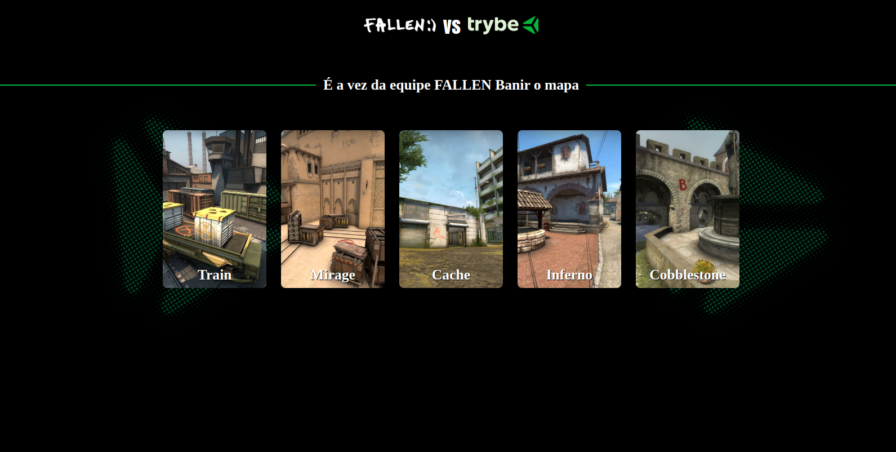

<h1 align="center"># Projeto Realizado em 3 dias de Live com a escola Trybe e o Jogador de CSGO Fallen </h1>

1 - Realizado Estrutura basica de HTML e CSS  
2 - Foi adicionado os Cards para manipulação 
3 - Foi Adicionado JavaScript: 

1 - Config (Escolha de times Trybe vs Fallen) 
2 - Manipulação de Array (mapPool) 
3 - Adicionado (querySlector / innerText) para imprimir na tela qual time irá banir o mapa. 
4 - Criado uma Função de (if e else) para selecionar os times. 
5 - Foi Criado uma Função para dar 'Pick' nos mapas quando clicado 
6 - Estrutura de (For (click)) para as escolhas dos mapas. 

# Autores

[ Bruno de Souza Farias](https://github.com/BrunoSouzaFarias)

